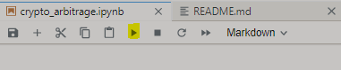
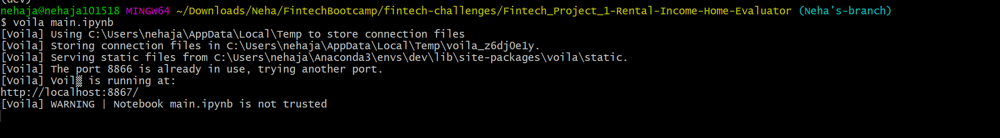
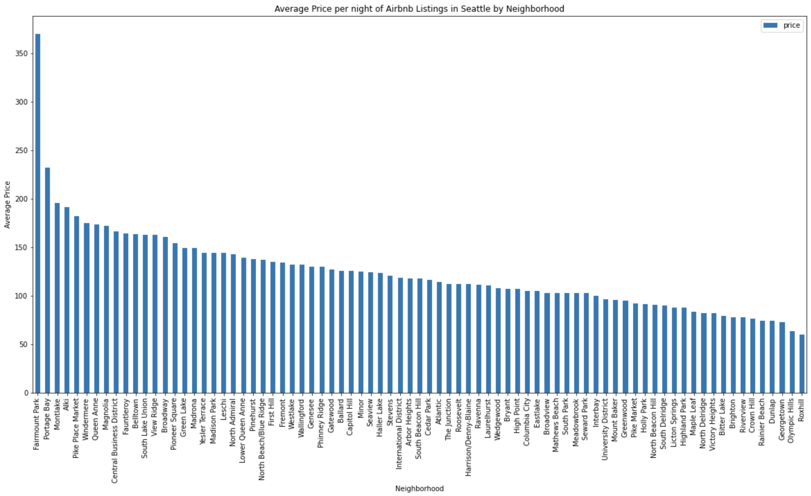
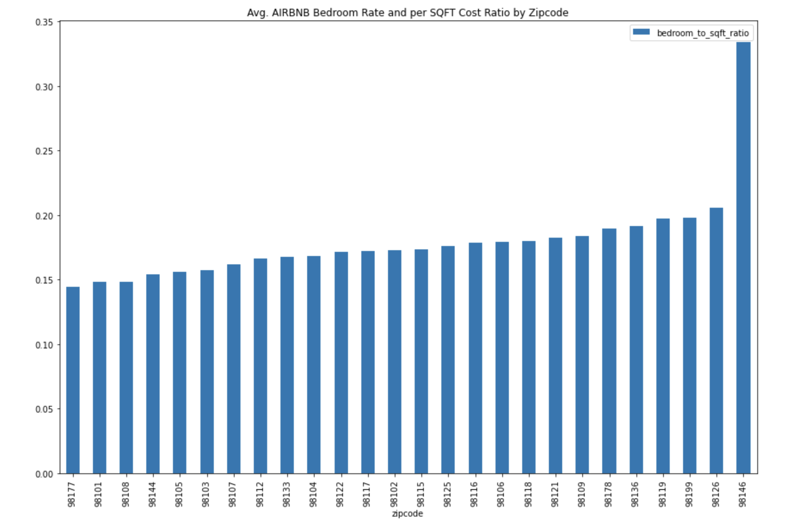
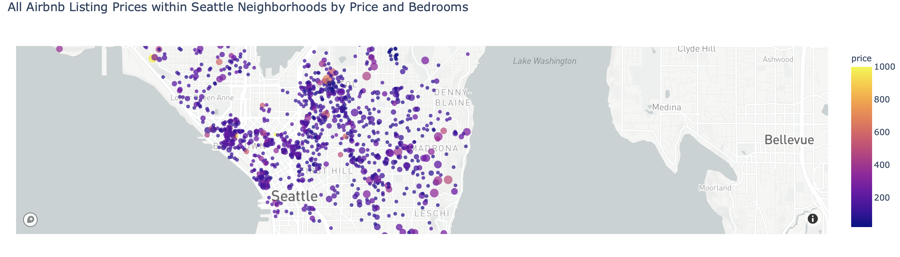
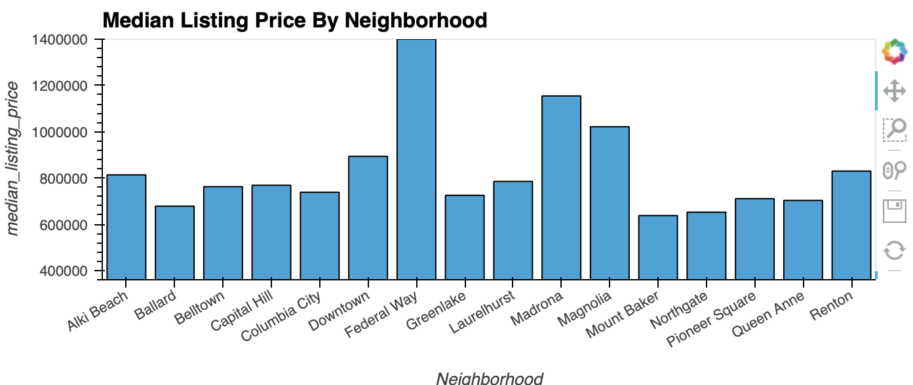
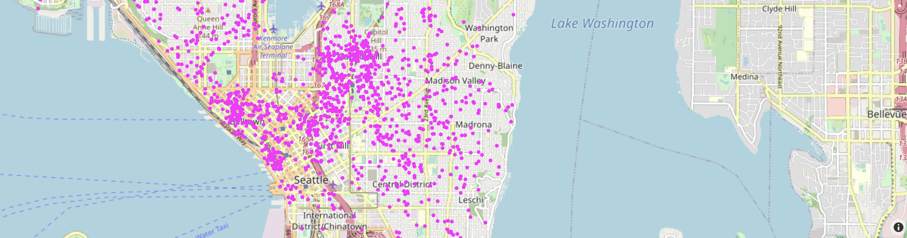

# Fintech Project1-Rental Income Home Evaluator

## Background
An executive summary/overview of the project and project goals.		The Rental-Income-Home-Evaluator project was developed to identify Western Washington areas with an emphasis on Seattle neighborhoods that would provide the best ROI for users to purchase a property that would be rented out on airbnb. This analysis provides the best and worst metrics for rentals on airbnb. This was accomplished  by identifying our datasets and utilizing pandas and several other libraries to clean, interpret and visualize the data. By leveraging this project it can analyze massive amounts of housing data by simply updating or importing new csv files.
 
## Data Collection, Cleanup & Exploration						
The project used data sourced from Kaggle and Realtor.com. After several days of researching it became apparent that this was the best free data we could utilize to accomplish our analysis. The data was thoroughly cleaned by removing symbols, updating types, removing empty data values, and was explored by using grouping and filtering functions.

## The approach that your group took in achieving the project goals		
Per the data we collected our group developed a few KPI’s and visualizations to assist in identifying the area that had the highest ROI properties to buy and rent out on airbnb. A few issues we faced was the lack of square footage in the airbnb data and the year over year data in the house sales data did not overlap well with the airbnb data. The four key areas we reviewed were 				
1) The rent price / selling price	 							
2) Visualizing the average listing price per night by neighborhood 				
3) Visualizing the total selling price by zip code year over year				
4) The airbnb nightly rental price / bedrooms  then /  by the cost per square foot by zip code 

## Usage

To use this application, simply clone the repository and open jupyter lab from git bash by running the following command:

```python
jupyter lab
```

Upon launching the application in Jupyter lab notebook, run the file by using the run button on the top of the notepad.



### Deploy the Notebook as a Web Application
For this part of the assignment, complete the following steps:

Use the Voilà library to deploy your notebook as a web application. You can deploy the web application locally on your computer.

Steps:
* Run the command "voila main.ipynb" in gitbash/terminal


* On the browser, you will see the web application as follows:


---
## Examples

### Average price per night

### Bedroom to Square feet

### House Listing Visualizations

### Median Listing Price by Neighborhood in Seattle

### Street map for Seattle housing


---
## Next Steps											
Some of the things we considered but were unable to incorporate would be:
 A national analyzer that would also take into consideration economic and population growth. 
Identify and utilize additional data sources that have an API that could automatically update the data.
Continue to identify additional data points that could help further provide insight. 
At the beginning of the project we considered including the questionnaire and fire libraries but due to time constraints and scope of data deemed it unnecessary at this time for a MVP. 
Things to consider : 
1. On average how many nights of the year is each area occupied (rented out) how has that changed over time.
2. Depending on the down payment amount how does that impact the long term ROI. 
3. Does the property have AOA fees and if so how have those changed over time? 
4. Are there any special rules or laws to have a short term rental in the neighborhood? 
5. Consider seasonality of the frequency of stays
## Contributors

Brought to you by Cole Ferrell, Martique Henton, Neha Jantre, Zach Zwiener.

---

## License

MIT